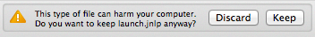
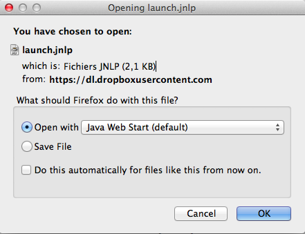
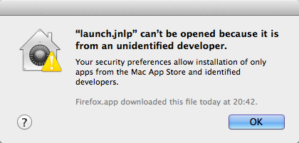
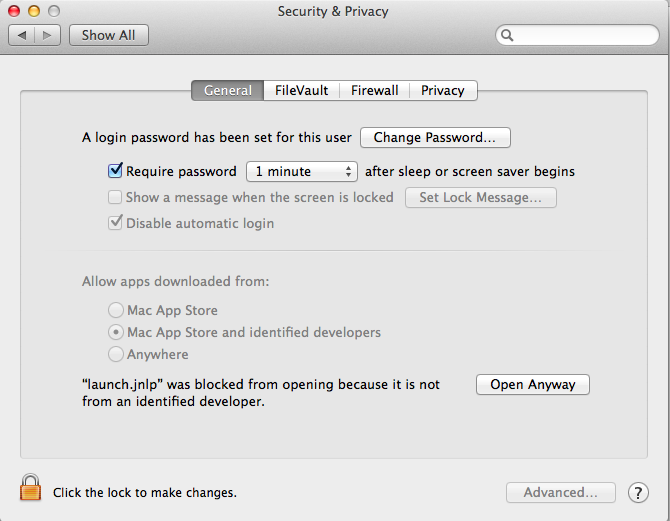
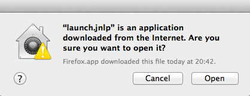
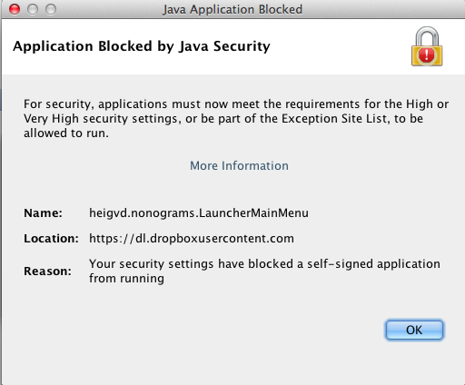
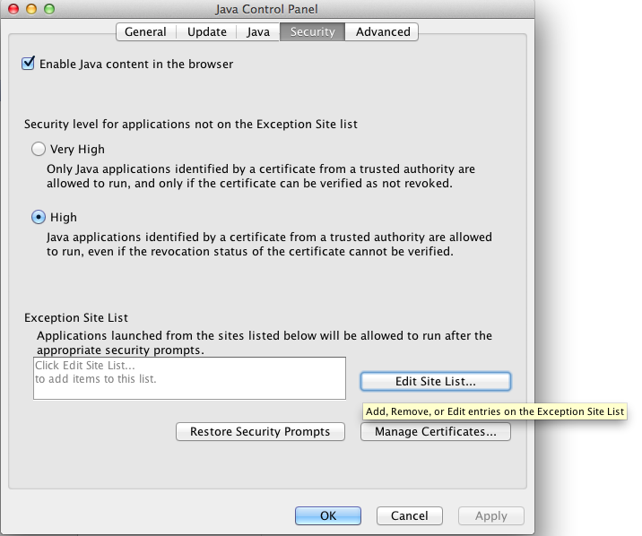
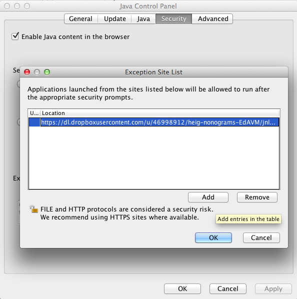
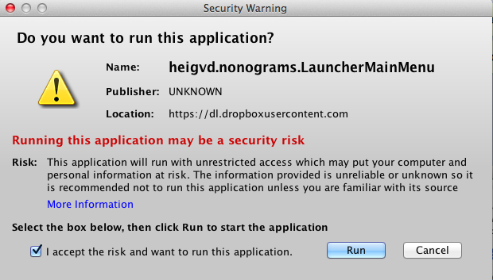
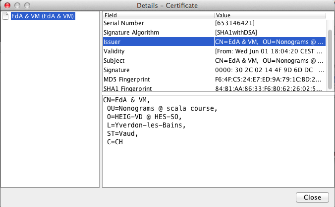

# scala-nonograms

A scala project at HEIG-VD, Switzerland.

A stand-alone game about [nonograms](https://en.wikipedia.org/wiki/Nonogram) using the scage library with maven.

Authors:

- [Eleonore d'Agostino](https://github.com/paranoodle)
- [Valentin Minder](https://github.com/ValentinMinder)

## Scage Library

We used the scage library to make our project run. Scage is a framework to write simple 2D opengl games, written in Scala. [Find out more about Scage](https://github.com/dunnololda/scage/#introduction).

## Run & Build Instructions

### How to test with maven

Type: `mvn clean test`. All tests must be successful.

### How to build with maven

Type: `mvn clean install`

Or, to build and skip the tests, type: `mvn clean package -Dmaven.test.skip`

The target is available under `target/nonograms-##.zip`

It contains a runnable script and all necessary librairies to be runnable stand-alone.

To troobleshoot follow [these indications](https://github.com/dunnololda/scage/#for-maven-users).

### How to test & build with IntelijIDEA

The very first time, you need to create all necessary file and dependancies with maven. Type `mvn clean compile`

In the IDE, try to run the main class (NonogramsOffline.scala). Then, edit the config launch of the last run and add under `VM Options:`

`-Djava.library.path=target/natives -DLWJGL_DISABLE_XRANDR=true -Dfile.encoding=UTF-8`

Alternatively, follow the instructions [here](https://github.com/dunnololda/scage/#intellij-idea).

### How to run the ZIP release (all OS): easy

1. Download the latest release
 - from the [releases page](https://github.com/paranoodle/scala-nonograms/releases) 
 - from [here for UNIX/MacOSX/Linux](https://dl.dropboxusercontent.com/u/46998912/heig-nonograms-EdAVM/nonograms-0.1-linux.zip) 
 - from [here for Windows](https://dl.dropboxusercontent.com/u/46998912/heig-nonograms-EdAVM/nonograms-0.1-windows.zip)
1. Unzip it
1. Run it with the given script
	
	- on Windows with the `run.bat` file
	- on UNIX with the `run.sh` file. From the terminal, you may need to change execution rights with `chmod u+x run.sh` and then run with `sh ./run.sh`.

### How to run the JNLP release with Java Web Start (all OS): harder

1. **Download the latest JNLP file** from [the releases page](https://github.com/paranoodle/scala-nonograms/releases) or from [here](https://dl.dropboxusercontent.com/u/46998912/heig-nonograms-EdAVM/jnlp/launch.jnlp).

	- **Safari users** should have no problems.

	- **Chrome users**: by-pass the browser warning *This type of file can harm your computer.* and click **Keep** 

	- **Firefox** users have the possibility to direct launch with Java Web Start, but its recommended to rather **Save File**, as some more security settings have to be changed
	

1. **Double-click on the JNLP file to launch it.** 

	- most **MacOS X users** will have several problems (if they 
		- First, this screen will appear. It is because the application is self-signed, and therefore not recognized as legitimate.
		
		- Go to `System Preferences > Security & Privacy > General` and click **Open Anyway**
		
		- When you see this, click **Open**
		

	- **All users** will get a warning (running Java 8u20 and above): *Application Blocked by Java Security*. It is because the application is self-signed, and therefore not recognized as legitimate.
	

1. **Change Java Security Exception List** from the **Java Control Panel**

	- **UNIX users**: type `javaws -viewer` in Terminal

	- **MacOS X users**: go to `System Preferences > Java` or see [here](http://java.com/en/download/help/mac_controlpanel.xml)

	- **Windows users**: go to `Windows Start menu > Programs > Java program > Configure Java` and it will launch the Java Control Panel, or see [here](http://java.com/en/download/help/win_controlpanel.xml)
	
	
	From the **Java Control Panel**, go to `Security > Exception Site List > Edit Site List > Add` and add the following URL
	
	```
	https://dl.dropboxusercontent.com/u/46998912/heig-nonograms-EdAVM/jnlp/launch.jnlp
	```
	
	
	[More information about JCP Security](http://java.com/en/download/help/jcp_security.xml)

1. **Re-run the application**. You will get a **Security Warning** like this one. Again, it is because the application is self-signed, and therefore not recognized as legitimate.
	
	Check that the name is correctly `heigvd.nonograms.LauncherMainMenu`. Hover location and checki it is 
	`https://dl.dropboxusercontent.com/u/46998912/heig-nonograms-EdAVM/jnlp/nonograms-0.1.jnlp`

	
	
	Click on **More Information** then **View Certificate Details**
	
	Check the certificate, it should correspond to the following signatures: 
	- MD5: `F6:4F:C5:24:E7:ED:9A:79:1C:BD:25:6E:E0:EF:31:87`
	- SHA-1: `84:B1:AA:86:33:F6:B0:62:26:02:5E:CB:86:92:7F:19:1C:52:7B:36`
	
	
	
	Tick **I accept the risk and want to run this application** and click **Run**.

1. **The app is now live!**

When you don't need the app anymore, go to your Java Control Panel
 	
- remove the exception from `Security > Exception Site List > Edit Site List > Remove`
- restore security prompts `Security > Restore Security Prompts`
- clear the cache from `General > Temporary Internet Files` and then:
	- `Settings > Delete Files > Cached & Installed Applications and Applets`
	- `View > Applications > Nonograms > right-click > delete`