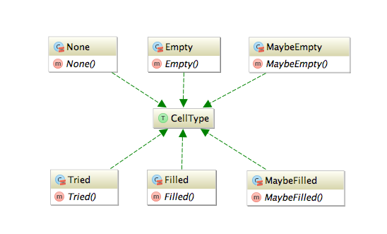

# Nonograms game in Scala (Full Report)

## Introduction
This is a Scala project done at HEIG-VD, Switzerland. It is a stand-alone game about [Nonograms](https://en.wikipedia.org/wiki/Nonogram) using the Scage library with maven.

It was done in Spring 2016 by [Eleonore d'Agostino](https://github.com/paranoodle) & [Valentin Minder](https://github.com/ValentinMinder).

Please find the run and/or deployment instructions in the [`README`](README.md) file.

## Goals of the project / Functionalities
This project is an implementation of the **Nonogram** game, a type of logic puzzle in which cells in a grid must be determined as either filled or empty, often in order to produce a hidden picture (in which case they are also known as *Picross* puzzles).

Nonograms have a variant involving several colors, but our implementation is the standard black-and-white version.

There is an example:


### Functionalities

- Choose from randomly generated grids of the size of your choosing, or pre-made grids with hidden pictures
- Two gameplay styles: Free and Supervised. In **Free style**, there are absolutely no restrictions as to which cells you can fill, meaning that if you make a mistake, it's up to you to notice so. In **Supervised style**, mistakes are pointed out as you do them, in exchange for a time penalty for each mistake (this mode is also called checkMode or strictMode in some parts of the code).
- Ability to go into **Draft mode** to try filling certain cells you might be unsure of. You can exit draft mode at any time by either cancelling your draft, and therefore returning to the state before you started drafting, or validating your draft, therefore applying all your changes to the grid. If playing with the supervised style, mistakes will only be pointed out once you *apply* the draft.

### Rules

**(This is somehow redundant - There are the rules written in the game help)**

Nonograms are a type of logic puzzle, where the aim is to color
the cells in the grid according to the given numbers.

Per example, a line listed as '2 1 3' would consist of:

- 2 contiguous filled squares
- followed by at least one space
- then another filled square.
- followed by at least one space
- and then three more contiguous filled squares.

Examples: --XX-X-XXX, XX--X--XXX, -XX-X-XXX-

There can be any number of leading and trailing spaces.

To finish the game you need to find all filled squares.

The controls are simple:

- Left-click a square to fill it
- Right-click a square to mark it as empty

The goal is to find all filled squares. Empty squares marks
are only to help you, you are free not to use them.

When playing a random grid, there might be multiple solutions.

If you are unsure about the accuracy of your guesses,
you can use 'Draft Mode' to try filling squares.

Draft mode gives the possibility of cancelling or validating
choices once you're ready to return to regular mode.

### Usage example

There is an example of usage, where a user is playing


In the center we can see the current state of the game. In the menu on the left, we can see:

- the user is playing in draft mode, and as the possibility to apply or cancel the draft (all the blue cells)
- the running time (with no penalties yet, they would correspond to the *Tried* ! cells)
- a progress bar. The game doesn't stop at 100%, but when the correct cells are filled. That's why the bar can go further than 100.
- buttons to restart the same game, to play a new game with the same config and return

## Using the Scage Library

We used the scage library to make our project run. Scage is a framework to write simple 2D OpenGL games, written in Scala. [Find out more about Scage](https://github.com/dunnololda/scage/#introduction).

Scage was very much a mixed bag in terms of how well we were able to use it. On the one hand, having a library that bundled up many java libraries for use in scala, with all the OpenGL code written for us was incredibly practical. On the other, Scage lacks any form of proper documentation, and there were several things we had to code entirely by hand when it could have made sense for the engine to handle at least part of it.

Per example, we coded our own buttons, but had to modify the code several times to understand how to get them to display on a specific screen and not just some random one. ("Random" because we could not figure out how it decided which screen to go on, only that it was not the one we were calling it from.)

Another example is how we handled the name input on the menu screen, where we needed to make a map of keys to... key values (`Map(KEY_1 -> "1", KEY_A -> "a")` and so on) and then iterate over them to create key bindings, because the `any_key` function, that triggers an event any time any key is pressed, doesn't pass the key name as parameter.

## Data model and MVC structure

Our project is structured into a MVC structure. You can see the project structure here.


The core of the program is found in Grid and UserGrid models: 

- A **Grid** represent the solution of the Grid. Its main field is a double-array of booleans: either the cell is filled (black) or it's empty (white) and contains the solution. It has no state.

- A **UserGrid** represent the current state of completion of a certain grid. Its main field is a double-array of CellTypes (see below). It allows all the interaction (change the state of a cell, validate or cancel the draft, reset the game, etc.)


A Cell might be of several CellType:

- **None** : a cell as no state, the default state, represented by a blank cell
- **Filled** : the user believes the cell **is** filled, represented by a filled black cell
- **Empty** : the user believes the cell **is** empty, represented by a X
- **Filled** : the user believes the cell ***might be*** filled, represented by a filled blue cell with a ?
- **Empty** : the user believes the cell ***might be*** empty, represented by a empty blue cell with a ?
- **Tried** : in strict mode, the user failed to guess a filled cell where there was none. This counts a penalty.



### A note about lists orders

Internally, grid state is a `List[List[Boolean]]`, which means you can directly access element `(x,y)` with `l(x)(y)`. However, it means that the internal lists are in non-human readable format.

Example:

`List(List(1,1), List(0,0))`

would be

```
| -> x
v  10
y  10
```

This format is anti-intuitive at construction time, but very practical for direct random access `(x,y)`. To address this issue constructors of Grid are provided with an option (`humanreadable`) to allow logical human format as in input. In human-readable format, the input is what you will see on the screen.

### Collecting data with Amazon

When a user is playing, anonymous data are sent on a server on Amazon. It includes the username and the current game state, as it is seen by the user. This allows us to track the usage and do some cool grafics.

Some metrics about usage.


The number of grids played by each username.


Hopefully for the final demo we will have a live leaderboard of competitors. :D

## Completion

### Tests and Code Coverage

We extensively tested the models and their methods with extended Unit tests. The classes that are targeted especially are Grid and UserGrid. There are 17 tests that cover 100% line coverage of the models.


A single test is a little *fake* to reach the 100% coverage. To test the clicks, you have to test two clicks (right and left) on all possible states (6), in two modes (strict or not), with or without draft activated. This would be 2 * 2 * 2 * 6 = 48 tests. We decided to tests only a few, and then generate all possible clicks without actually testing anything. This resulted in the last 5% of UserGrid coverage.

The UI is not unit tested. Instead we performed several quality tests ourselves, then made an alpha pre-release one week before the deadline. Many of our class mates tested the product and reported several bug or improvements. Thanks to them! ;)

### Current state

We reached a state where the accomplishment follows completely the goals of the project. The UI was cleaned and is ready for production.

We developed many options (username, draft mode, strict mode), however the game it still simple and many additional features could be implemented.

### Known Issues

Nothing to mention to our knowledge. Most bugs / UI issues were found and fixed during the alpha pre-release. There should be no issues during normal use.

### Possible additional features

- Add an option for keyboard controls in addition to the current mouse controls, through the use of a tile cursor
- allows the user to create / load grids from text or other format
- Refine the random grid generator to use procedural generation instead of the current, entirely random generation
- Addition of an interactive tutorial instead of a simple how-to guide
- More Easter eggs, such as the *Konami code* or others

## Conclusion

Even if we were a little lost with this framework, especially at first, this was a very interesting project to do. With Scage being very light on documentation, that meant we had the opportunity to experiment a lot and essentially code small engine parts ourselves, as with the buttons.

Choosing a nonogram game as the target also meant we had a very clear goal with easily trackable progress, but while keeping an fairly interesting end result.

As for the end result itself, we're quite happy with it. The game is completely playable, with enough quality-of-life options that it isn't a chore to interact with, and runs smoothly.

Scala is fun/1 :)